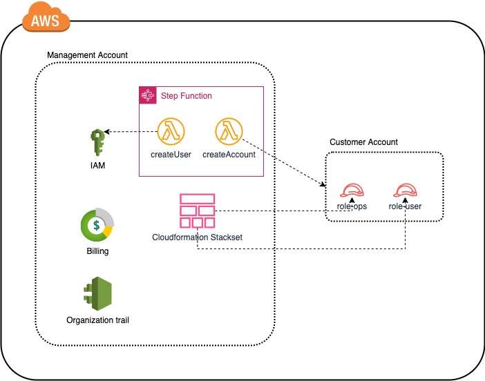

# AWS Account factory project

This project is an AWS account factory using CDK.

It is deploying resources in only one Stack and uses Constructs to split resources, trying to follow [CDK best practices](https://docs.aws.amazon.com/cdk/v2/guide/best-practices.html) as much as possible.

1. ## 🧰 Prerequisite

	- 🛠 AWS CLI Installed & Configured
	- 🛠 AWS CDK version 2.x Installed & Configured
	- [node](https://nodejs.org/en/)  runtime with [npm](https://www.npmjs.com/)

2. ## ⚙️ Setting up the environment

	- run `npm i` from the root folder
	- Set your environment variables: 

	> ORGANIZATION_ID : The id of your AWS Organization

	> ROOT_OU: The id of your Root Organization
	
	> EMAIL: The administrator of your AWS organization. This email is used for billing and for alternate contacts on AWS accountts.

3. ##  🚀 Deployment using cdk

   ```bash
   # If you DON'T have cdk installed
   npm install aws-cdk
	 # If you already have cdk but version 1.x, please refer to https://docs.aws.amazon.com/cdk/v2/guide/migrating-v2.html
   # If this is first time you are using cdk then, run cdk bootstrap
   cdk bootstrap


   # Make sure you in root directory
   npm i

   # Synthesize the template and deploy it
   cdk synth
   cdk deploy
   ```

4. ## 🧹 CleanUp

   If you want to destroy all the resources created by the stack, Execute the below command to delete the stack, or _you can delete the stack from console as well_.

   ```bash
   cdk destroy *
   ```

   This is not an exhaustive list, please carry out other necessary steps as maybe applicable to your needs.

5. ## 🏗️ Architecture of the project 

See below the current architecture. 


**Resources**: 

- Billing:

A budget is created with a limit of 100 USD, with 3 notifications. 
You can find this in the [managementAccount construct](lib/constructs/managementAccount.ts).

- Organization Trail

This resources allows to log everything actions from all the AWS account of your organization. You can find this in the [managementAccount construct](lib/constructs/managementAccount.ts).

- IAM User group

To group all common permissions for the created IAM users, they are automatically put into this User group. You can find this in the [managementAccount construct](lib/constructs/managementAccount.ts).

- AWS Lambda functions

As of January 2022, there are 2 lambdas deployed in the Management Account.

		- createAccount: Which creates the AWS account and wait for its creation before adding it to the Sandbox OU and adding alternate contact
		- createUse: which creates a new user for the new created account into the management account

You can find this in the [lambda folder](lambdas). And their CDK declaration in the [accountFactory construct](lib/constructs/accountFactory.ts)

Those 2 functions are to be called by an **AWS Step Function** each time an account needs to be created.

- AWS Step Function

This Step Function is supposed to be triggered manually each time an account needs to be created. You can find the declaration in the [accountFactory construct](lib/constructs/accountFactory.ts).

- AWS Cloudformation Stackset

An initAccount Stackset is used to deploy resources in the newly created account.
The goal is to deploy as less resources as possible in the account. 
For now it only deploys 2 roles:

		- role-ops: IAM role used by the administrator to connect onto the created AWS account. Mainly used to troubleshoot.
		- role-user: Jump role used by the owner of the new AWS account to access his accout.

You can find the declaration in the [initAccount construct](lib/constructs/initAccount.ts).

- AWS Organizations

The AWS Organization was created manually at the beginning of this project.
However, Organization Units are created using CDK and a cloudformation custom resources.
Indeed, as of January 2022, CDK or Cloudformation does not provide Organization constructs.
You can find OUs declaration in the [orrganizationUnit construct](lib/constructs/organizationUnits.ts).


